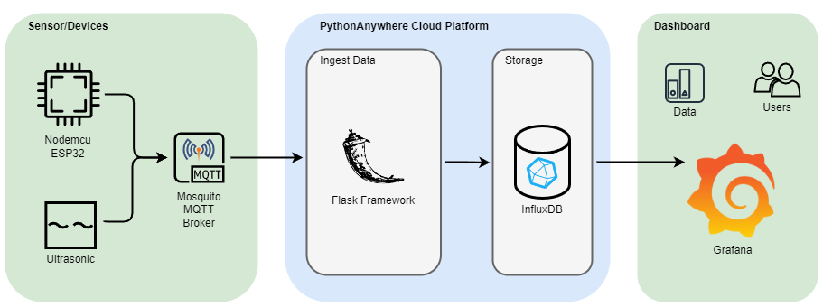
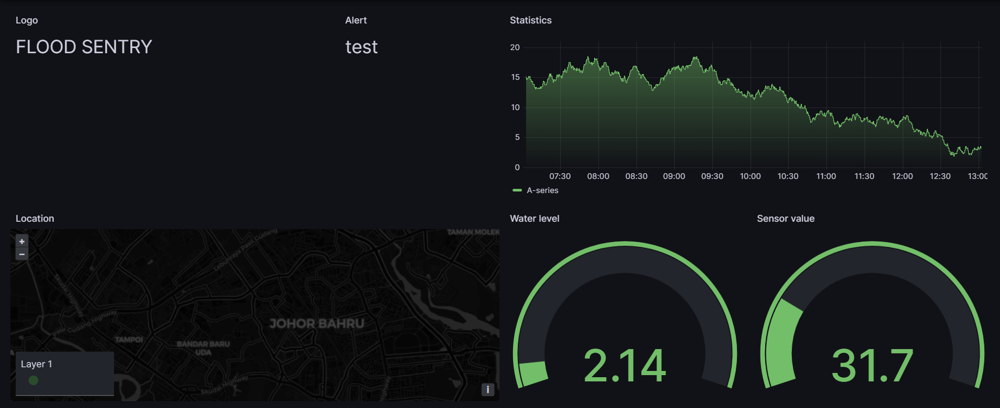

# Flood Sentry
### Software Engineering (SEEL4213)
#### Group: Rampaging Rhinos

  

#### Table of contents

 

[1.0 Problem Statement](#10-problem-statement)

[2.0 System Architecture](#20-system-architecture)

[3.0 Sensor](#30-sensor)
> [3.1 Nodemcu ESP32](#31-nodemcu-esp32)
>
> [3.2 Ultrasonic HC-SR04](#32-ultrasonic-hc-sr04)
> 
> [3.3 MQTT](#33-mqtt)

[4.0 Cloud Platform](#40-cloud-platform)
> [4.1 PythonAnywhere](#41-pythonanywhere)
>
> [4.2 Demo Video](#42-demo-video)

[5.0 Dashboard](#50-dashboard)
> [5.1 Grafana](#51-grafana)
>
> [5.2 User Interface](#52-user-interface)

 

## 1.0 Problem Statement

The frequent occurrence of floods in low-lying areas poses a significant threat to life and property. Traditional flood detection methods are often limited in scope, accuracy, and timeliness. There is a need for a reliable and efficient flood detection system that can alert people in advance of an impending flood and help them take appropriate measures to minimize the damage. The goal of this project is to develop a flood detection system that uses sensors, a cloud platform, and a dashboard to detect floods in real-time, generate alerts, and provide users with critical information to mitigate the impact of floods.

## 2.0 System Architecture

&nbsp;&nbsp;&nbsp;&nbsp;&nbsp;&nbsp;&nbsp;&nbsp; 

The system architecture consists of a ultrasonic HC-SR04 sensor that sends data to a microcontroller, which is NodeMCU ESP32. It connects to a Mosquitto MQTT broker and send the data via wifi. A Python Flask application run on a server hosted on PythonAnywhere subscribes to the MQTT broker, receives the data and stores it to an InfluxDB database. Grafana reads the data from InfluxDB database and visualize it in real-time dashboards. The dashboard is accessible to user via a public URL that is hosted on the PythonAnywhere cloud platform.

## 3.0 Sensor 

#### 3.1 Nodemcu ESP32

The NodeMCU ESP32 is a microcontroller that is ideal for the flood detection system. It features built-in WiFi and Bluetooth capabilities, making it easy to connect to the cloud platform and communicate with other devices. With its low power consumption and small form factor, the NodeMCU ESP32 is perfect for use in remote areas where power may be limited. To measure water level, sensors can be connected to the microcontroller for data collection to perform real-time analysis. This allowed for immediate detection and alert notifications.

#### 3.2 Ultrasonic HC-SR04

The HC-SR04 is an ultrasonic sensor that can be used as a water level sensor to measure the distance between the sensor and the water surface. It can determine the water level in real-time by emitting high-frequency sound waves and measuring the time taken for the echo to bounce back. It consists of a transmitter and a receiver module, which can detect objects within a range of 2cm to 400cm with an accuracy of up to 3mm. 

#### 3.3 MQTT
MQTT (Message Queuing Telemetry Transport) is a lightweight, open-source messaging protocol that is ideal for use in IoT (Internet of Things) applications. It can be used to establish a connection between the NodeMCU ESP32 microcontroller and PythonAnywhere cloud platform.

## 4.0 Cloud Platform

#### 4.1 PythonAnywhere
PythonAnywhere allows users to write and run Python code in the cloud, which is particularly useful for IoT projects that require a persistent and reliable connection. Additionally, PythonAnywhere provides a range of pre-installed libraries and packages, including those for IoT-related tasks such as data processing and visualization. It also has support for many popular IoT hardware devices, making it easy to interface with sensors and other devices. Finally, PythonAnywhere offers a simple user interface making it easy to manage and deploy IoT applications. 

#### 4.2 Demo Video
&nbsp;&nbsp;&nbsp;&nbsp;&nbsp;&nbsp;&nbsp;&nbsp; 

Porting flask app from stage 1 to PythonAnywhere 

## 5.0 Dashboard

#### 5.1 Grafana
Grafana is an open-source platform that allows users to visualize and analyze data from multiple sources through interactive and customizable dashboards. A Grafana dashboard is a collection of panels that display metrics and data in a visual format such as graphs, tables, and gauges. The dashboard can be customized according to the user's needs. Grafana also supports a wide range of data sources, databases, cloud services, and APIs. Thus, making it a versatile tool for monitoring and analyzing systems and applications.

#### 5.2 User Interface

&nbsp;&nbsp;&nbsp;&nbsp;&nbsp;&nbsp;&nbsp;&nbsp; 
